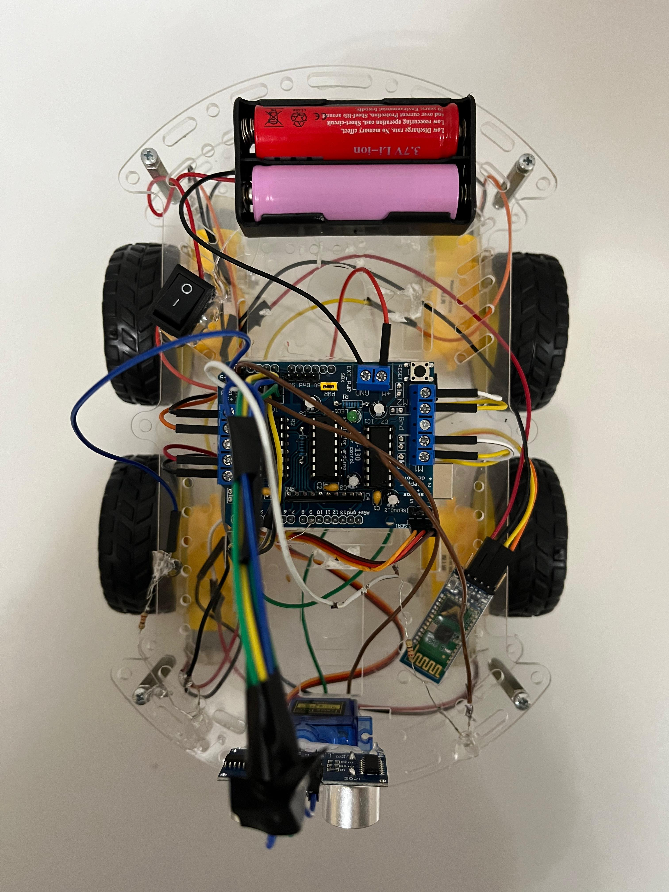
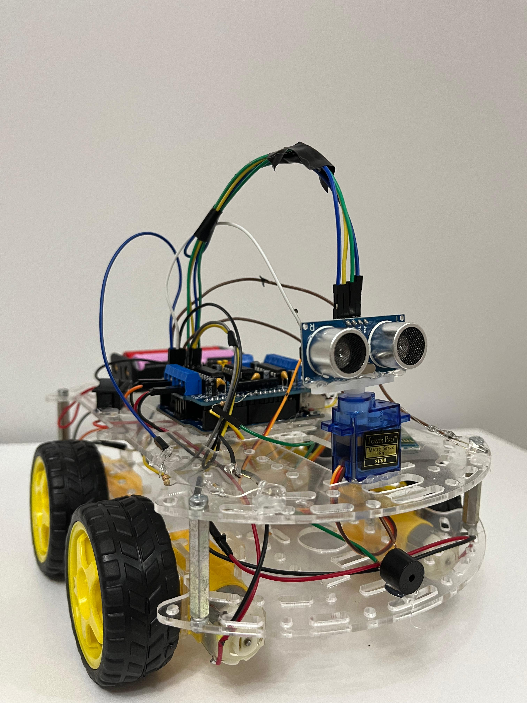

# 🚗 Smart Car Robot Project

This project is a multifunctional smart car controlled by an Arduino Uno. It supports:
- Obstacle avoidance
- Bluetooth manual control
- Voice control
- Lights and horn

---

## 📸 Project Photos

  
   <em>Top View</em>

  
   <em>Side View</em>

---

## ⚙️ Components Used

| # | Component                            |
|---|---------------------------------------|
| A | Arduino Uno                          |
| B | L298N Motor Driver Shield            |
| C | Ultrasonic Sensor HC-SR04            |
| D | Jumper Wires                         |
| E | SG90 Servo Motor                     |
| F | Bluetooth Module HC-05               |
| G | 2x 18650 Li-ion Batteries (3.7V)     |
| H | Battery Holder (2x18650)             |
| I | Boat Rocker Switch                   |
| J | 4x Wheels                            |
| K | 4x DC Geared Motors                  |
| L | Acrylic Plate Chassis                |
| M | 2x LEDs                               |
| N | Buzzer                               |
| O | 3x 220 Ohm Resistors                 |

---

## 🛠️ Assembly Steps

1. Attach the motor shield to the Arduino and mount it on the chassis.
2. Install and connect the DC geared motors.
3. Assemble the acrylic plates and attach the wheels.
4. Mount the servo motor and ultrasonic sensor; connect them.
5. Solder 220Ω resistors to LEDs and the buzzer.
6. Connect LEDs and the buzzer to the motor shield.
7. Connect and secure the Bluetooth module.
8. Install the battery holder and insert the batteries.
9. **Important:** Remove TX & RX pins from the Bluetooth module before uploading code.

---

## 💻 Programming

- Download the program and libraries here:  
  [Project Code and Libraries](https://drive.google.com/drive/folders/1jyLItCMqog7aEtQauIE6jvyHFuKo8V9M?usp=sharing)
- Download Arduino IDE:  
  [Arduino IDE Download](https://support.arduino.cc/hc/en-us/articles/360019833020-Download-and-install-Arduino-IDE)
- You can run each function separately by uncommenting the relevant code sections.

---

## 🎮 Control Modes

- **Bluetooth RC Car** – Manual control via smartphone app
- **Voice Control** – Control via voice commands
- **Obstacle Avoidance** – Autonomous navigation

---

## 👤 Author

Project by **Adam Kamal**

---

## 📝 License

This project is open-source. Feel free to use and modify it.

## 📄 Project Presentation

  
   
  <a href="./Smart_car.pdf"><strong>Click here to view the full presentation (PDF)</strong></a>

---
